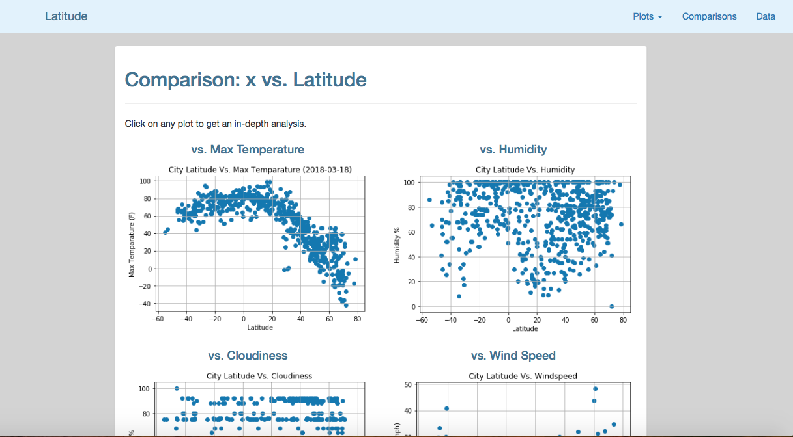

# Web Visualization Dashboard (Lattitude)

## Background

Data is more powerful when we share it with others! In this module, I have used HTML, CSS , Bootstrap skills to create a dashboard.
This Weather Analysis dashboard shows the analysis , visualizatons from WeatherPy module [https://github.com/girijaghali/06.API-challenge] 

## Lattitude - Latitude Analysis Dashboard 

For this visualization dashboard website I used the visualizations from the Weather API data analysis.  

The Weather dashboard contains, an individual pages for each plot and a means to navigate between them. These pages will contain the visualizations and their corresponding explanations. There is a landing page, a comparison page (comparison of all of the plots), and a data page contains the data used to build these visualizations.

### Website Requirements

The website  consist of 7 pages total, including:

* A [landing page](#landing-page) containing:
  * An explanation of the project.
  * Links to each visualizations page.
* Four [visualization pages](#visualization-pages), each with:
  * A descriptive title and heading tag.
  * The plot/visualization itself for the selected comparison.
  * A paragraph describing the plot and its significance.
* A ["Comparisons" page](#comparisons-page) that:
  * Contains all of the visualizations on the same page so we can easily visually compare them.
  * Uses a bootstrap grid for the visualizations.
    * The grid has two visualizations across on screens medium and larger, and 1 across on extra-small and small screens.
* A ["Data" page](#data-page) that:
  * Displays a responsive table containing the data used in the visualizations.
    * The table  is a bootstrap table component.
    * The data is exported from the `.csv` file as HTML. I used a csv-to-html table conversion tool, e.g. [ConvertCSV](http://www.convertcsv.com/csv-to-html.htm).

The website contains a navigation menu, at the top of every page:

* Has the name of the site on the left of the nav which allows users to return to the landing page from any page.
* Contains a dropdown on the right of the navbar named "Plots" which provides links to each individual visualization page.
* Provides two more links on the right: "Comparisons" which links to the comparisons page, and "Data" which links to the data page.
* Is responsive (using media queries).  ["Navigation Menu" section](#navigation-menu).

Finally, the website is deployed to github pages.

### Screenshots

This section contains screenshots of each page at varying screen widths. 

#### Landing page

Large screen:

Small screen:



#### Comparisons page

Large screen:

Small screen:

#### Data page

Large screen:

Small screen:

#### Visualization pages

You'll build four of these, one for each visualization. Here's an example of one:

Large screen:

Small screen:

#### Navigation menu

Large screen:

Small screen:

